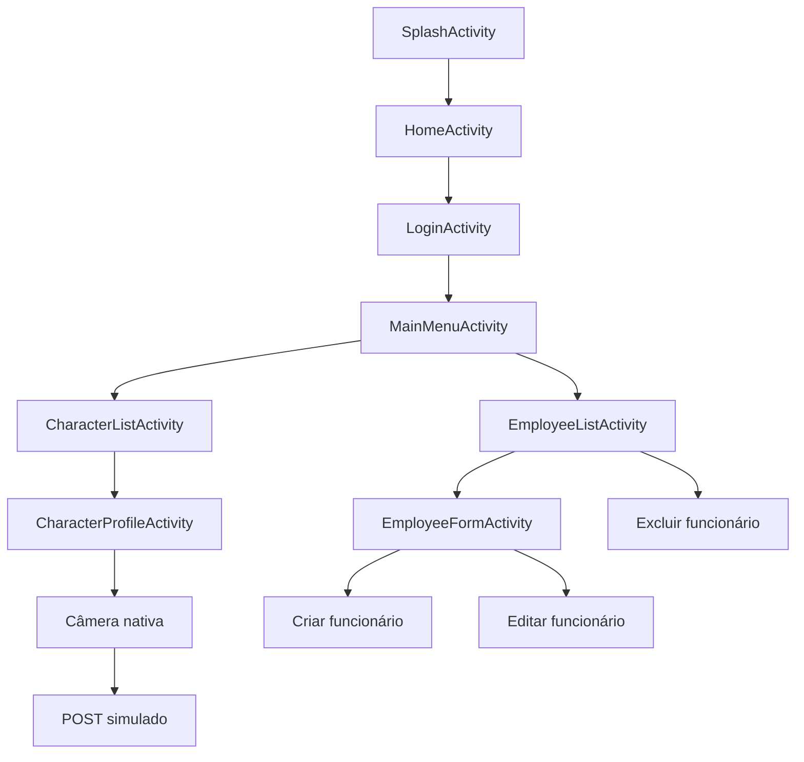
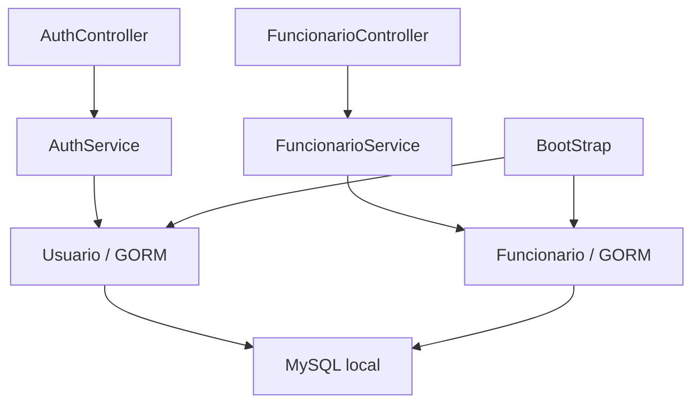
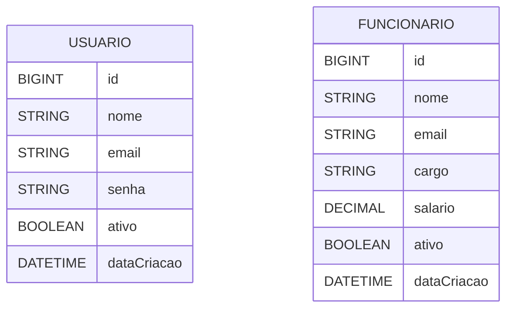
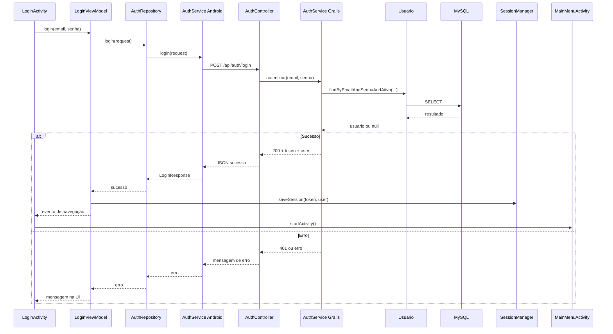
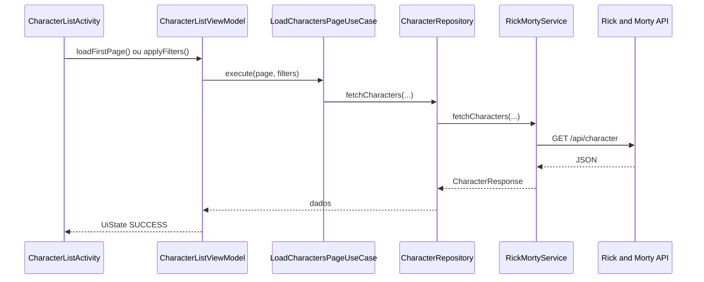
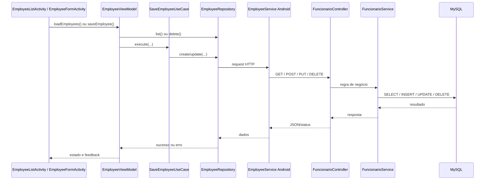
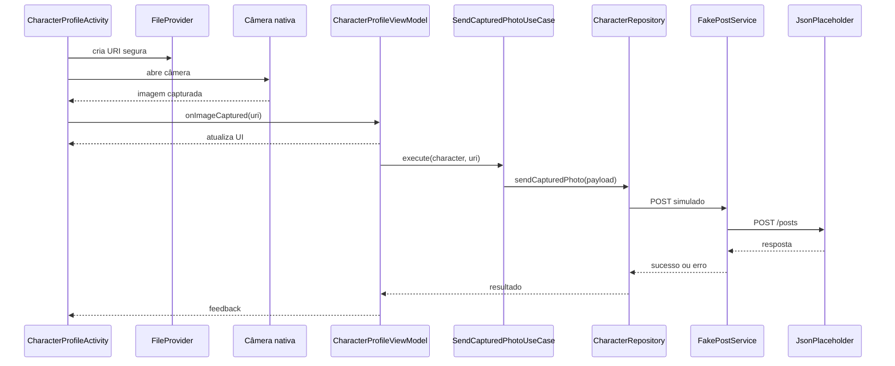

# Diagramas Mermaid do Projeto

Este arquivo reúne os diagramas visuais principais do app Android e do backend Grails.
O foco aqui é mostrar o fluxo central da aplicação, a arquitetura em camadas, o backend com MySQL e as integrações mais importantes, sem repetição desnecessária.

## 1. Fluxo geral do aplicativo

Este diagrama resume a navegação principal do app desde a abertura até os dois módulos centrais.
Ele também destaca o fluxo de perfil com câmera e POST simulado, além do CRUD de funcionários.

## 2. Arquitetura Android MVVM

Este diagrama mostra a separação em camadas do app Android.
Os três fluxos principais usam a mesma base: Activity/XML, ViewModel, UseCase ou Repository, Service/OkHttp e API ou backend.

```mermaid
flowchart TD
    subgraph LoginFlow["Login"]
        LoginActivity["LoginActivity / XML"] --> LoginViewModel["LoginViewModel"]
        LoginViewModel --> AuthRepository["AuthRepository"]
        AuthRepository --> AuthService["AuthService"]
        AuthService --> OkHttpLogin["OkHttp3"]
        OkHttpLogin --> GrailsLogin["Backend Grails"]
    end

    subgraph CharacterFlow["Personagens"]
        CharacterListActivity["CharacterListActivity / XML"] --> CharacterListViewModel["CharacterListViewModel"]
        CharacterListViewModel --> LoadCharactersPageUseCase["LoadCharactersPageUseCase"]
        CharacterListViewModel --> CharacterRepository["CharacterRepository"]
        LoadCharactersPageUseCase --> CharacterRepository
        CharacterRepository --> RickMortyService["RickMortyService"]
        RickMortyService --> OkHttpCharacters["OkHttp3"]
        OkHttpCharacters --> RickAndMortyApi["Rick and Morty API"]
    end

    subgraph EmployeeFlow["Funcionários"]
        EmployeeScreens["EmployeeListActivity / EmployeeFormActivity"] --> EmployeeViewModel["EmployeeViewModel"]
        EmployeeViewModel --> SaveEmployeeUseCase["SaveEmployeeUseCase"]
        EmployeeViewModel --> EmployeeRepository["EmployeeRepository"]
        SaveEmployeeUseCase --> EmployeeRepository
        EmployeeRepository --> EmployeeService["EmployeeService"]
        EmployeeService --> OkHttpEmployees["OkHttp3"]
        OkHttpEmployees --> GrailsEmployees["Backend Grails"]
    end
```

## 3. Arquitetura Backend Grails

Este diagrama resume a organização do backend em controller, service, domain/GORM e banco local.
Também mostra o papel do `BootStrap` na criação do usuário administrador e dos dados iniciais.

## 4. Modelo de dados MySQL

Este diagrama mostra as duas entidades persistidas pelo backend.
Como não existe relacionamento direto implementado entre elas, os blocos ficam separados.

## 5. Sequência de login

Este fluxo detalha o caminho do login do Android até o MySQL e o retorno para a UI.
Ele cobre tanto o caso de sucesso com sessão local quanto o caso de erro com mensagem ao usuário.

## 6. Sequência dos módulos principais

Os três diagramas abaixo mostram o caminho principal de personagens, funcionários e câmera.
Eles foram mantidos separados para continuar legíveis e objetivos.

### 6.1 Personagens

### 6.2 Funcionários

### 6.3 Câmera e POST simulado

