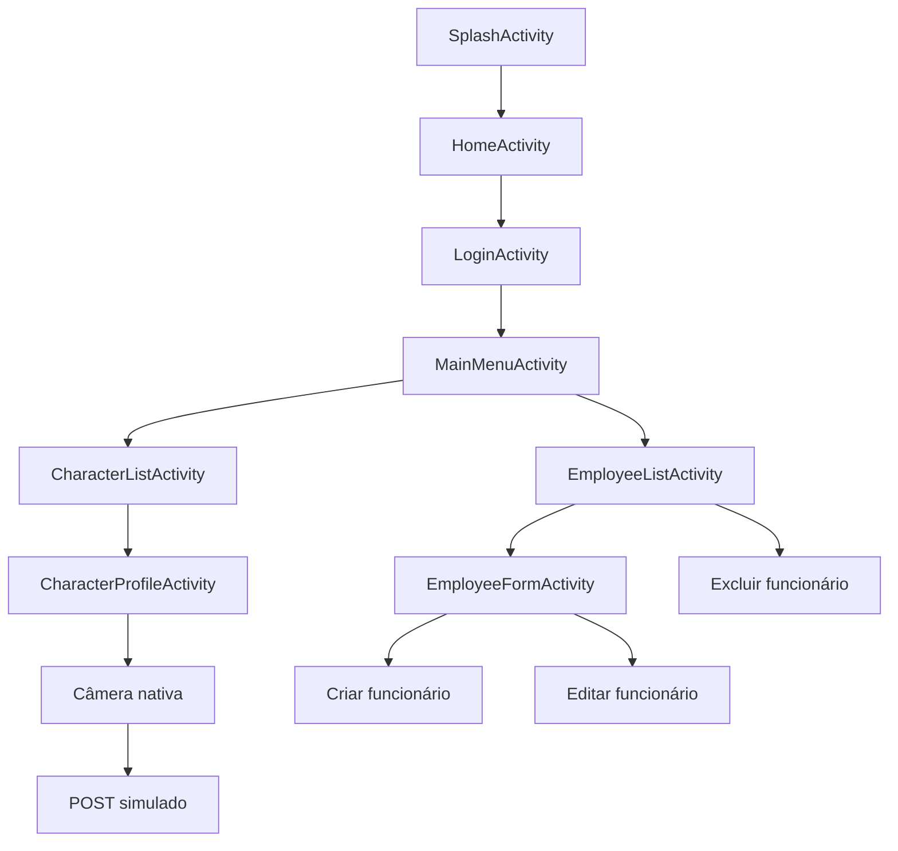

# RickAndMortyApp

Aplicativo Android nativo em Java, com Views/XML e MVVM, desenvolvido para o teste técnico Android Nativo Júnior. O app consome a API pública Rick and Morty para listagem e perfil de personagens e integra com um backend local Grails/Groovy + MySQL para autenticação e CRUD de funcionários.

O projeto implementa:

- Splash Activity animada
- Tela inicial
- Login com backend próprio
- Sessão simples
- Menu principal
- Listagem paginada de personagens
- Filtros por status, gênero e espécie
- Perfil do personagem com 10+ informações
- Câmera nativa para atualizar a foto do personagem
- POST simulado para JsonPlaceholder
- CRUD de funcionários
- Backend Grails/Groovy
- Persistência em MySQL local
- Testes automatizados
- Diagramas Mermaid

## Prints do aplicativo

Prints atuais do fluxo principal:

<p align="center">
  
  
  
</p>

<p align="center">
  
  
  
</p>

<p align="center">
  
  
  
</p>

## Estrutura do repositório

- `app/` — aplicativo Android
- `backend-grails/` — backend Grails/Groovy
- `app_imagens/` — prints atuais do aplicativo
- `docsimp/` — documentação auxiliar do desafio
- `DIAGRAMAS_MERMAID.md` — diagramas visuais principais do projeto
- `testes_backend.md` — resumo dos testes automatizados

## Stack utilizada

### Android

- Java
- Views/XML
- MVVM
- ViewModel + LiveData
- RecyclerView
- ListAdapter + DiffUtil
- OkHttp3
- Gson
- Glide
- Material Components
- FileProvider
- JUnit

### Backend

- Grails/Groovy
- GORM
- MySQL local
- Gradle Wrapper
- Spock/MockMvc nos testes

### APIs externas

- Rick and Morty API
- JsonPlaceholder

## Arquitetura

### Android

Fluxo principal por camadas:

```text
Activity/XML
  -> ViewModel
  -> UseCase, quando agrega valor
  -> Repository
  -> Service/RemoteDataSource
  -> OkHttp3
  -> API pública ou Backend Grails
```

Pontos principais:

- MVVM é a arquitetura central do app
- UseCases foram usados de forma leve, apenas onde havia regra clara
- Repositories isolam a UI da origem dos dados e adaptam erros
- Services cuidam das chamadas HTTP com OkHttp3
- `UiState` organiza loading, sucesso, erro e vazio
- `Event<T>` evita repetição de Snackbar, `finish()` e navegação após rotação

Exemplos reais:

- `LoginActivity -> LoginViewModel -> AuthRepository -> AuthService`
- `CharacterListActivity -> CharacterListViewModel -> LoadCharactersPageUseCase -> CharacterRepository -> RickMortyService`
- `EmployeeListActivity/EmployeeFormActivity -> EmployeeViewModel -> SaveEmployeeUseCase -> EmployeeRepository -> EmployeeService`

### Backend

Fluxo principal do backend:

```text
Controller
  -> Service
  -> Domain/GORM
  -> MySQL
```

Exemplos reais:

- `AuthController -> AuthService -> Usuario/GORM -> MySQL`
- `FuncionarioController -> FuncionarioService -> Funcionario/GORM -> MySQL`

## Decisões técnicas relevantes

### 1. MVVM no Android

As Activities inicializam views, configuram listeners, observam estado e navegam. As ViewModels concentram estado e coordenam chamadas para UseCases e Repositories.

### 2. UseCases leves

Foram usados apenas onde havia ganho claro:

- `LoadCharactersPageUseCase` — paginação e filtros
- `SaveEmployeeUseCase` — validação e decisão entre create/update
- `SendCapturedPhotoUseCase` — montagem do POST simulado da câmera

### 3. Repository Pattern

Repositories separam a UI da origem dos dados e traduzem erros técnicos em respostas mais adequadas para a tela.

### 4. ApiResult e UiState

`ApiResult` padroniza sucesso e erro na camada de dados. `UiState` e estados específicos de tela organizam loading, sucesso, erro e vazio na UI.

### 5. Event<T>

Eventos transitórios, como Snackbar, `finish()` e navegação após login, são consumidos uma única vez para evitar repetição após rotação ou recriação de Activity.

### 6. DiffUtil

As listas principais usam `ListAdapter + DiffUtil` para atualização mais eficiente e visualmente estável dos RecyclerViews.

### 7. Câmera e FileProvider

A atualização da foto do personagem usa a câmera nativa do Android com `FileProvider`, gerando uma URI segura sem criar câmera customizada.

### 8. Tradução da UI

Status, gênero e espécie são exibidos em português na interface, mas continuam em inglês internamente quando precisam ser enviados para a API Rick and Morty.

### 9. Backend simples

A autenticação usa senha em texto puro e token simples apenas por simplicidade do teste técnico. Em produção, o correto seria usar hash seguro, como BCrypt, e token/sessão robustos, como JWT ou sessão controlada.

## Fluxo geral do aplicativo

Diagrama resumido do fluxo principal. Os diagramas completos e as demais visões arquiteturais estão em [DIAGRAMAS_MERMAID.md](DIAGRAMAS_MERMAID.md).



## Diagramas Mermaid

Os diagramas principais do projeto estão em:

- [DIAGRAMAS_MERMAID.md](DIAGRAMAS_MERMAID.md)

O arquivo inclui:

- fluxo geral do aplicativo
- arquitetura Android MVVM
- arquitetura do backend Grails
- modelo de dados MySQL
- sequência de login
- sequência dos módulos principais

## Pré-requisitos

Para rodar o projeto localmente:

- Android Studio instalado
- JDK compatível com o projeto
- Android SDK configurado
- MySQL Server local
- PowerShell ou terminal equivalente no Windows
- Emulador Android ou celular físico com depuração USB

## Backend Grails + MySQL

### 1. Criar o banco

Opção SQL:

```sql
CREATE DATABASE IF NOT EXISTS rick_morty_app
CHARACTER SET utf8mb4
COLLATE utf8mb4_unicode_ci;
```

Opção via script auxiliar:

```powershell
cd backend-grails
$env:DB_USERNAME="root"
$env:DB_PASSWORD="sua_senha_do_mysql"
.\scripts\create-database.ps1 -DbUsername $env:DB_USERNAME -DbPassword $env:DB_PASSWORD
```

Arquivos auxiliares:

- `backend-grails/scripts/create-database.sql`
- `backend-grails/scripts/create-database.ps1`

### 2. Definir credenciais do banco

No PowerShell:

```powershell
$env:DB_USERNAME="root"
$env:DB_PASSWORD="sua_senha_do_mysql"
```

Use a senha configurada no seu MySQL local.

### 3. Subir o backend

Comando principal:

```powershell
cd backend-grails
$env:DB_USERNAME="root"
$env:DB_PASSWORD="sua_senha_do_mysql"
.\gradlew.bat --% bootRun -Dgrails.env=mysql
```

Observações:

- o fluxo principal da entrega é MySQL local
- o backend expõe os endpoints de login e CRUD de funcionários na porta `8080`
- o ambiente `debugh2` existe apenas como alternativa de debug, não como fluxo principal

### 4. Credenciais de login

- e-mail: `admin@empresa.com`
- senha: `123456`

## Endpoints principais

- `POST /api/auth/login`
- `GET /api/funcionarios`
- `GET /api/funcionarios/{id}`
- `POST /api/funcionarios`
- `PUT /api/funcionarios/{id}`
- `DELETE /api/funcionarios/{id}`

## Base URL usada pelo app

O app atualmente está configurado em [Constants.java](app/src/main/java/com/example/rickandmortyapp/util/Constants.java) com:

```java
public static final String BACKEND_BASE_URL = "http://localhost:8080";
```

Esse snapshot atual está ideal para **celular físico via USB com `adb reverse`**.

## Como testar no Android

Guia detalhado:

- [docsimp/COMO_RODAR_ANDROID.md](docsimp/COMO_RODAR_ANDROID.md)

### 1. Emulador Android

Para emulador, altere temporariamente em `Constants.java`:

```java
public static final String BACKEND_BASE_URL = "http://10.0.2.2:8080";
```

Passos:

1. Suba o backend Grails localmente.
2. Inicie o emulador Android.
3. Execute o app pelo Android Studio.
4. Faça login com `admin@empresa.com / 123456`.

### 2. Celular físico com adb reverse

Com o app no estado atual, este é o fluxo mais direto.

Passos:

1. Ative a depuração USB no celular.
2. Conecte o aparelho via USB.
3. Rode:

```powershell
adb devices
adb reverse tcp:8080 tcp:8080
```

4. Instale e abra o app.
5. Faça login com `admin@empresa.com / 123456`.

Nesse cenário, `http://localhost:8080` no celular aponta para o backend rodando no PC.

### 3. Celular físico por rede local

Para testar pela mesma rede Wi-Fi, altere temporariamente em `Constants.java`:

```java
public static final String BACKEND_BASE_URL = "http://IP_DA_MAQUINA:8080";
```

Exemplo:

```java
public static final String BACKEND_BASE_URL = "http://192.168.0.15:8080";
```

Passos:

1. Coloque PC e celular na mesma rede.
2. Descubra o IPv4 da máquina com `ipconfig`.
3. Libere a porta `8080` no firewall para rede privada, se necessário.
4. Reinstale o app com a URL ajustada.

## Como compilar e executar o app Android

Compilação do app:

```powershell
.\gradlew.bat :app:compileDebugJavaWithJavac
```

Testes unitários locais do app:

```powershell
.\gradlew.bat :app:testDebugUnitTest
```

Execução:

1. Abra o projeto no Android Studio.
2. Suba o backend Grails.
3. Configure a `BACKEND_BASE_URL` conforme o ambiente.
4. Rode o app no emulador ou no aparelho.

## Build e testes

### App Android

Comandos:

```powershell
.\gradlew.bat :app:compileDebugJavaWithJavac
.\gradlew.bat :app:testDebugUnitTest
```

Cobertura atual:

- `Event<T>`
- `CharacterQueryBuilder`
- `LoadCharactersPageUseCase`

### Backend Grails

Comandos:

```powershell
cd backend-grails
.\gradlew.bat compileGroovy
.\gradlew.bat test
```

Cobertura atual:

- login válido e inválido
- login com body vazio
- campos obrigatórios do login
- CRUD completo de funcionários
- funcionário inexistente
- dados inválidos
- e-mail duplicado

Resumo adicional:

- [testes_backend.md](testes_backend.md)

## Dependências relevantes

Android:

- AppCompat
- Material Components
- ConstraintLayout
- RecyclerView
- SwipeRefreshLayout
- Lifecycle ViewModel
- Lifecycle LiveData
- OkHttp3
- Gson
- Glide

Backend:

- Grails Web
- Grails REST
- GORM / Hibernate
- MySQL Connector/J
- H2 apenas para ambiente de teste/debug


