# Diagramas Mermaid do projeto

Este documento contém os diagramas principais para orientar a IA/Codex durante a implementação.

## 1. Diagrama geral de arquitetura

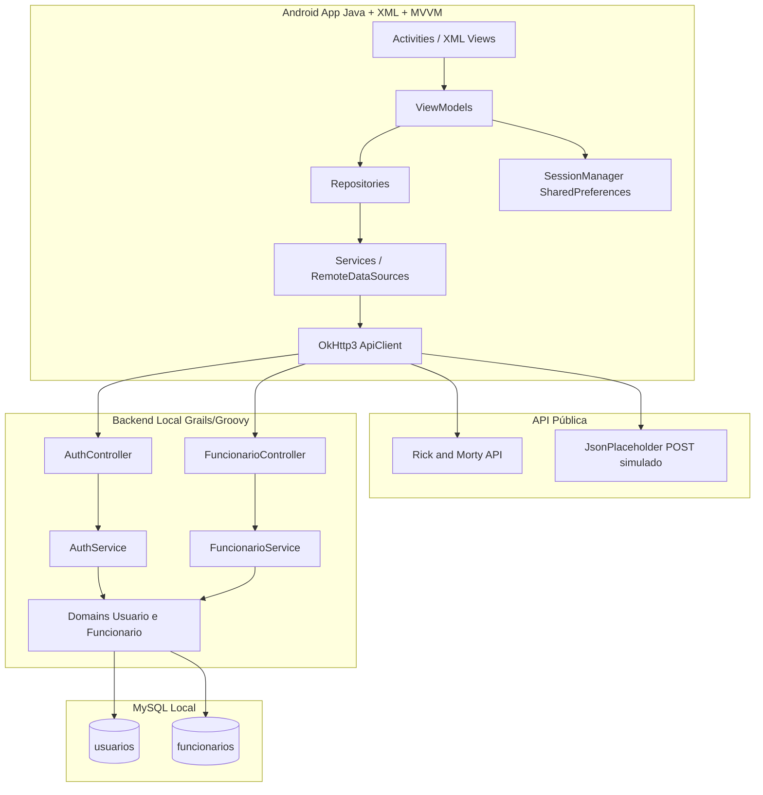

## 2. Diagrama de fluxo principal do app

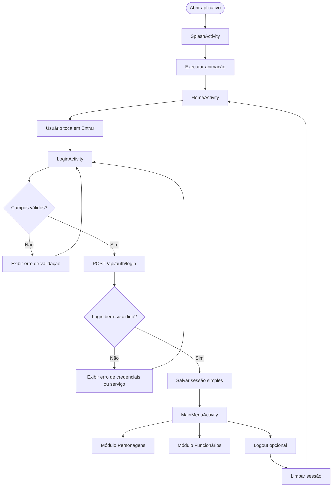

## 3. Diagrama de fluxo do módulo personagens

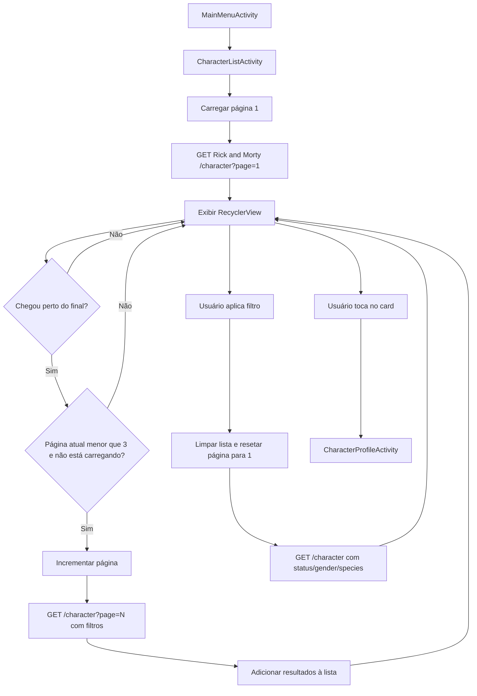

## 4. Diagrama de fluxo do perfil e câmera

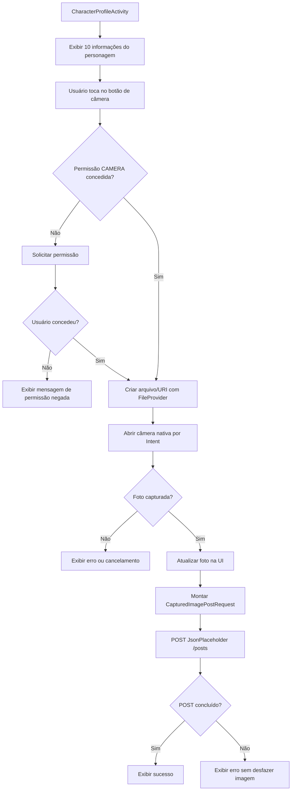

## 5. Diagrama de fluxo do CRUD de funcionários

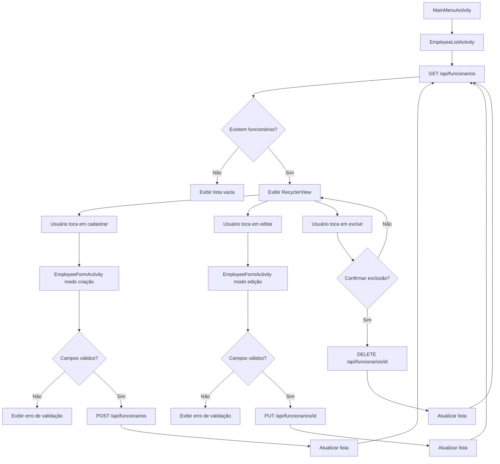

## 6. Diagrama de atividades do login

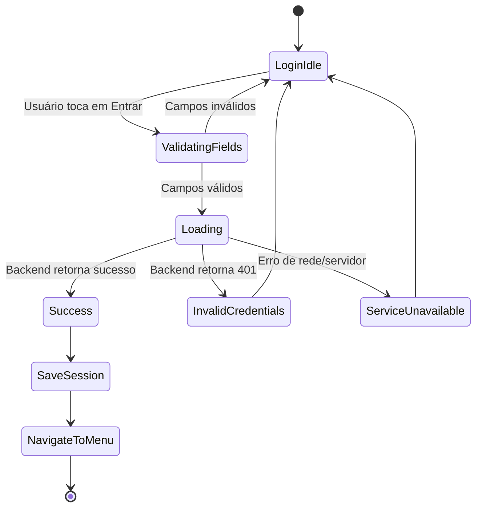

## 7. Diagrama de atividades da listagem de personagens

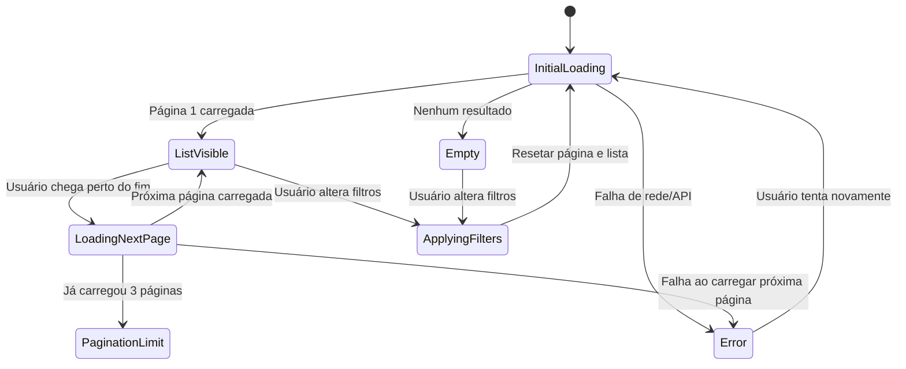

## 8. Diagrama de atividades da câmera

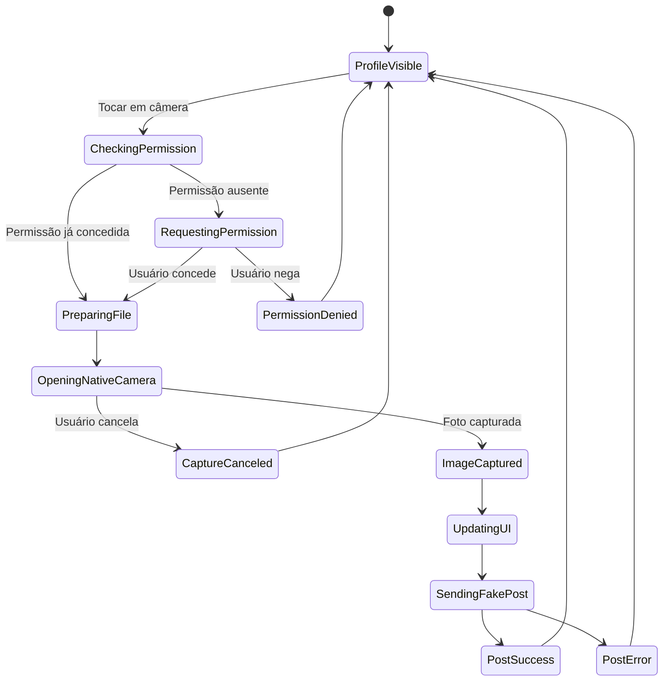

## 9. Diagrama de classes Android

```mermaid
classDiagram
    class SplashActivity {
        +onCreate()
        -startAnimation()
        -navigateToHome()
    }

    class HomeActivity {
        +onCreate()
        -goToLogin()
    }

    class LoginActivity {
        -LoginViewModel viewModel
        +onCreate()
        -setupObservers()
        -submitLogin()
        -renderState(UiState)
    }

    class MainMenuActivity {
        +onCreate()
        -goToCharacters()
        -goToEmployees()
        -logout()
    }

    class CharacterListActivity {
        -CharacterListViewModel viewModel
        -CharacterAdapter adapter
        +onCreate()
        -setupRecyclerView()
        -setupFilters()
        -setupPagination()
        -renderState(UiState)
    }

    class CharacterProfileActivity {
        -CharacterProfileViewModel viewModel
        +onCreate()
        -renderCharacter()
        -requestCamera()
        -openNativeCamera()
        -renderCapturedImage()
    }

    class EmployeeListActivity {
        -EmployeeViewModel viewModel
        -EmployeeAdapter adapter
        +onCreate()
        -setupRecyclerView()
        -loadEmployees()
        -openCreateForm()
        -openEditForm()
        -confirmDelete()
    }

    class EmployeeFormActivity {
        -EmployeeViewModel viewModel
        +onCreate()
        -fillFormIfEditing()
        -validateFields()
        -saveEmployee()
    }

    class LoginViewModel {
        -AuthRepository repository
        -MutableLiveData~UiState~ loginState
        +login(email, senha)
        +getLoginState()
    }

    class CharacterListViewModel {
        -CharacterRepository repository
        -MutableLiveData~UiState~ charactersState
        -int currentPage
        -boolean isLoading
        -List~Character~ loadedCharacters
        +loadFirstPage()
        +loadNextPage()
        +applyFilters(status, gender, species)
        +getCharactersState()
    }

    class CharacterProfileViewModel {
        -CharacterRepository repository
        -MutableLiveData~Uri~ capturedImageUri
        +setCharacter(character)
        +onImageCaptured(uri)
        +sendCapturedImagePost()
    }

    class EmployeeViewModel {
        -EmployeeRepository repository
        -MutableLiveData~UiState~ employeesState
        +loadEmployees()
        +createEmployee(request)
        +updateEmployee(id, request)
        +deleteEmployee(id)
    }

    class AuthRepository {
        -AuthService service
        +login(LoginRequest)
    }

    class CharacterRepository {
        -RickMortyService service
        -FakePostService fakePostService
        +getCharacters(page, status, gender, species)
        +sendCapturedImagePost(request)
    }

    class EmployeeRepository {
        -EmployeeService service
        +list()
        +getById(id)
        +create(request)
        +update(id, request)
        +delete(id)
    }

    class ApiClient {
        -OkHttpClient client
        +getInstance()
        +getClient()
    }

    class RequestFactory {
        +get(url)
        +postJson(url, json)
        +putJson(url, json)
        +delete(url)
    }

    class SessionManager {
        +saveSession(token, user)
        +isLoggedIn()
        +getToken()
        +clear()
    }

    class UiState~T~ {
        +Status status
        +T data
        +String message
        +loading()
        +success(data)
        +error(message)
        +empty()
    }

    LoginActivity --> LoginViewModel
    CharacterListActivity --> CharacterListViewModel
    CharacterProfileActivity --> CharacterProfileViewModel
    EmployeeListActivity --> EmployeeViewModel
    EmployeeFormActivity --> EmployeeViewModel

    LoginViewModel --> AuthRepository
    CharacterListViewModel --> CharacterRepository
    CharacterProfileViewModel --> CharacterRepository
    EmployeeViewModel --> EmployeeRepository

    AuthRepository --> AuthService
    CharacterRepository --> RickMortyService
    CharacterRepository --> FakePostService
    EmployeeRepository --> EmployeeService

    AuthService --> ApiClient
    RickMortyService --> ApiClient
    FakePostService --> ApiClient
    EmployeeService --> ApiClient

    AuthService --> RequestFactory
    RickMortyService --> RequestFactory
    FakePostService --> RequestFactory
    EmployeeService --> RequestFactory

    LoginViewModel --> SessionManager
```

## 10. Diagrama de classes do backend Grails

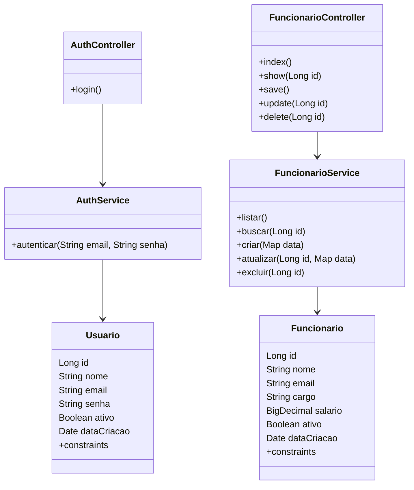

## 11. Diagrama de dados SQL

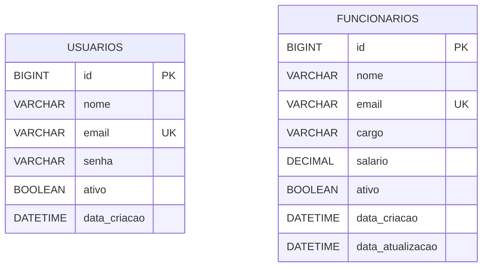

## 12. Diagrama de sequência do login

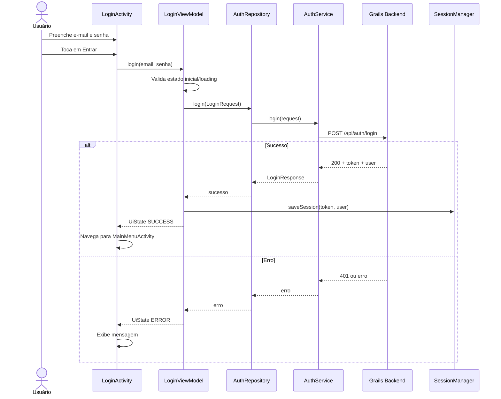

## 13. Diagrama de sequência da listagem de personagens

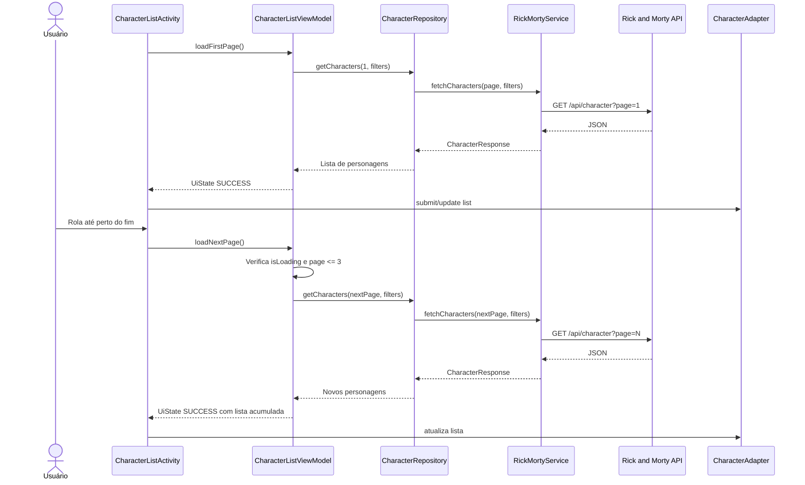

## 14. Diagrama de sequência do CRUD de funcionários

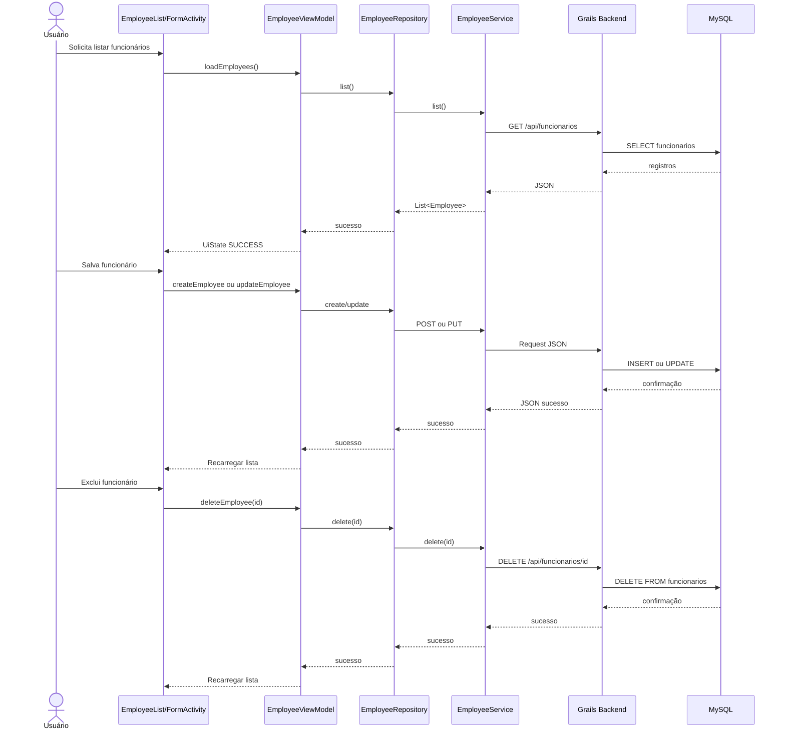

## 15. Diagrama de componentes

```mermaid
flowchart LR
    subgraph UI["Camada UI"]
        SplashActivity
        HomeActivity
        LoginActivity
        MainMenuActivity
        CharacterListActivity
        CharacterProfileActivity
        EmployeeListActivity
        EmployeeFormActivity
    end

    subgraph VM["Camada ViewModel"]
        LoginViewModel
        CharacterListViewModel
        CharacterProfileViewModel
        EmployeeViewModel
    end

    subgraph DATA["Camada Data"]
        AuthRepository
        CharacterRepository
        EmployeeRepository
        AuthService
        RickMortyService
        EmployeeService
        FakePostService
        ApiClient
    end

    subgraph UTIL["Utilitários"]
        UiState
        SessionManager
        RequestFactory
        CharacterQueryBuilder
        ValidationUtils
    end

    subgraph EXT["Sistemas externos"]
        RickMortyAPI["Rick and Morty API"]
        JsonPlaceholder
        GrailsBackend["Grails Backend"]
        MySQL
    end

    UI --> VM
    VM --> DATA
    VM --> UTIL
    DATA --> UTIL
    DATA --> EXT
    GrailsBackend --> MySQL
```
